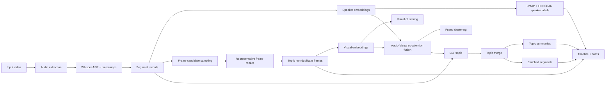
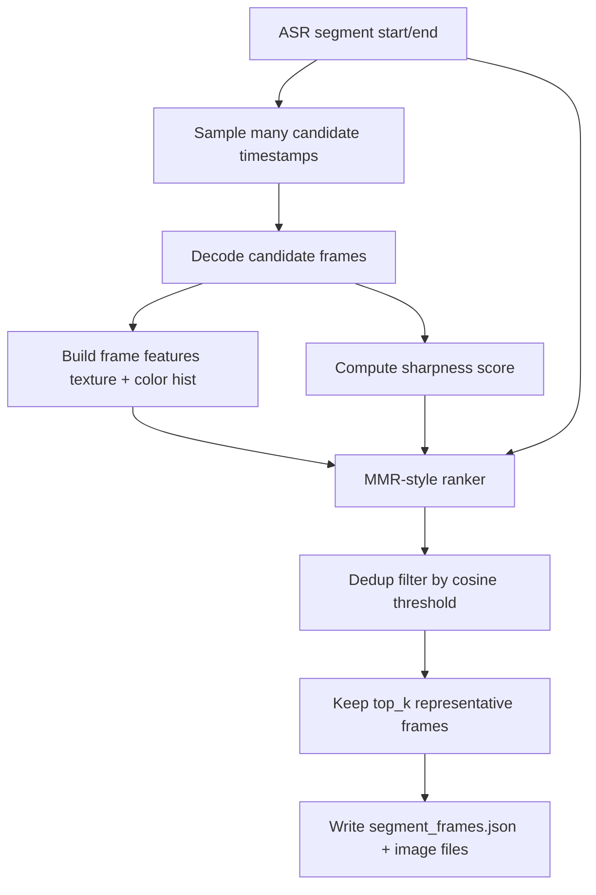
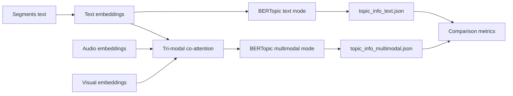

# Video Topic Modeling

This repository contains a research prototype pipeline for multimodal video topic modeling.

## Architecture



The pipeline is intentionally modular: transcription, audio/visual embeddings, clustering, topic extraction, topic summarization, and visualization are all separate stages so you can rerun only the slices you need.

## Frame Selection and Ranking Flow



Notes for the new ranker stage:

- The frame stage now samples a candidate pool first, then ranks and deduplicates.
- `top_k_per_segment` is the final number kept per segment, not just the number sampled.
- Candidate pool size is controlled by:
  - `frames.candidate_multiplier`
  - `frames.min_candidate_frames`
- Duplicate suppression is controlled by:
  - `frames.dedup_similarity_threshold`
- Diversity vs representativeness trade-off is controlled by:
  - `frames.diversity_lambda`

## Topic Mode Branching



## Pipeline Stages (Detailed)

1. Audio extraction (`audio`)
  - Converts video to mono PCM WAV with configurable sample rate and codec.
  - Output: `data/processed/<video>/audio.wav`.

2. ASR segmentation (`asr`)
  - Runs Whisper and produces timestamped transcript segments.
  - Output: `segments.json` with `segment_id`, `start_s`, `end_s`, and text.

3. Speaker representation + clustering (`speaker`)
  - Builds segment-level speaker embeddings (pyannote, with fallback behavior).
  - Clusters via UMAP + HDBSCAN and attaches speaker labels.
  - Outputs include `audio_embeddings.npy` and `audio_umap.npy`.

4. Candidate frame extraction + ranking (`frames`)
  - Samples candidate timestamps per segment.
  - Extracts candidate frames, computes features, and scores representativeness.
  - Removes near-duplicates using cosine similarity thresholding.
  - Persists only final top-k representative frames per segment.
  - Outputs: `frames/` and `segment_frames.json`.

5. Visual embedding (`clip`)
  - Encodes selected representative frames with OpenCLIP or a vLLM API.
  - Averages frame embeddings to one segment-level visual vector.
  - Output: `visual_embeddings.npy`.

6. Visual clustering (`visual_cluster`)
  - Applies UMAP + HDBSCAN on visual embeddings.
  - Output: `visual_umap.npy`.

7. Audio-visual fusion (`fusion`)
  - Performs weighted co-attention-style fusion.
  - Output: `fused_embeddings.npy` and `fused_umap.npy`.

8. Topic modeling (`topic`)
  - Supports `text`, `multimodal`, or `both` embedding-source modes.
  - Supports `unsupervised` and `guided` topic mode.
  - Outputs mode-specific topic files and enriched segment files.

9. Topic reduction + summaries (`merge`, `summary`)
  - Reduces semantically similar micro-topics.
  - Generates extractive summaries per merged topic.

10. Evaluation (`metrics`)
  - Computes structural, lexical, transition, coherence, and clustering metrics.
  - Produces mode-specific metrics when running both text and multimodal topic spaces.

11. Visualization (`viz`)
  - Builds interactive timeline/cards with speaker, topic, summaries, and selected frames.
  - Output: `timeline.html`.

## Setup

```bash
python3 -m venv .venv
source .venv/bin/activate
pip install -r requirements.txt
```

Make sure `ffmpeg` is installed and available on `PATH`.

Optional environment variable for pyannote model access:

```bash
export HF_TOKEN=your_huggingface_token
```

## Run

```bash
python -m src.pipeline_run \
  --video data/7630817_h264_1920_1080_8000kb_baseline_de_8000.mp4 \
  --config configs/default.yaml
```

Run all MP4 files under a directory:

```bash
python -m src.pipeline_run \
  --all-mp4 \
  --video-dir data \
  --config configs/default.yaml
```

Run selected stages only:

```bash
python -m src.pipeline_run \
  --video data/7630817_h264_1920_1080_8000kb_baseline_de_8000.mp4 \
  --stages audio,asr,speaker,frames,clip,topic,viz
```

## Guided / Semi-supervised Topics

By default, BERTopic runs unsupervised. To guide topic discovery toward known themes, edit `configs/default.yaml` and add `topic.seed_topic_list` entries such as:

```yaml
topic:
  mode: guided
  seed_topic_list:
    - ["war", "conflict", "battle", "army"]
    - ["democracy", "freedom", "election", "parliament"]
    - ["peace", "reconciliation", "history", "memory"]
```

This keeps the model semi-supervised in the BERTopic sense: the embedding clustering still happens automatically, but the seed phrases steer the topic space toward your desired categories.

## Multimodal Topic Embedding Space

Topic modeling can run in two modes:

- `topic.embedding_source: text` (classic BERTopic text embeddings)
- `topic.embedding_source: multimodal` (tri-modal co-attention embeddings from text+audio+visual)
- `topic.embedding_source: both` (runs both, writes side-by-side outputs and metrics)

When `multimodal` is selected, the pipeline:

1. Encodes transcript segments as text embeddings.
2. Loads segment-level audio and visual embeddings.
3. Applies tri-modal co-attention fusion with configurable weights:
   - `topic.weight_text`
   - `topic.weight_audio`
   - `topic.weight_visual`
4. Uses the fused embedding space directly in BERTopic (`fit_transform(..., embeddings=...)`).

Example config:

```yaml
topic:
  embedding_source: multimodal
  weight_text: 0.34
  weight_audio: 0.33
  weight_visual: 0.33
```

## Visual Embedding Backend (CLIP or vLLM API)

The visual stage supports two backends:

- `clip`: local OpenCLIP image embeddings (default)
- `vllm_api`: embeddings fetched from a vLLM/OpenAI-compatible API endpoint

Example config for vLLM API mode:

```yaml
clip:
  backend: vllm_api
  vllm_base_url: http://localhost:8000/v1
  vllm_endpoint: /embeddings
  vllm_model: Qwen/Qwen2.5-VL-7B-Instruct
  vllm_api_key_env: VLLM_API_KEY
  vllm_timeout_s: 60
  fallback_embedding_dim: 1024
```

If your endpoint requires auth, set:

```bash
export VLLM_API_KEY=your_api_key
```

The pipeline sends each frame as a data-URI payload and expects an embedding response in a common JSON format (`data[0].embedding`, `embedding`, or `vector`).

## Numeric Metrics

A `metrics.json` file is generated in each output directory with quantitative indicators, including:

- segment and duration statistics
- topic count, noise ratio, normalized entropy, and topic-size Gini
- topic transition rate over time
- vocabulary and average token length
- topic diversity over top words
- NPMI-based topic coherence estimate
- clustering quality indices (silhouette, Calinski-Harabasz, Davies-Bouldin) on available audio/visual/fused/multimodal-topic embeddings using topic assignments

When `topic.embedding_source: both`, metrics are split by source:

- `metrics_text.json`
- `metrics_multimodal.json`
- `metrics_comparison.json`

When using `--all-mp4`, the pipeline also creates an aggregate report at:

- `data/output/metrics_all_videos.json`

## Outputs

Outputs are written under `data/processed/<video_stem>/` and `data/output/<video_stem>/`.

Important artifacts:
- `segments.json`
- `audio_embeddings.npy`, `visual_embeddings.npy`, `fused_embeddings.npy`
- `topic_info.json`, `topic_info_text.json`, `topic_info_multimodal.json`, `topic_info_merged.json`
- `topic_summaries.json`
- `metrics.json`, `metrics_text.json`, `metrics_multimodal.json`, `metrics_comparison.json`
- `multimodal_topic_embeddings.npy` (when `topic.embedding_source=multimodal`)
- `segments_enriched.json`, `segments_enriched_text.json`, `segments_enriched_multimodal.json`
- `timeline.html`
