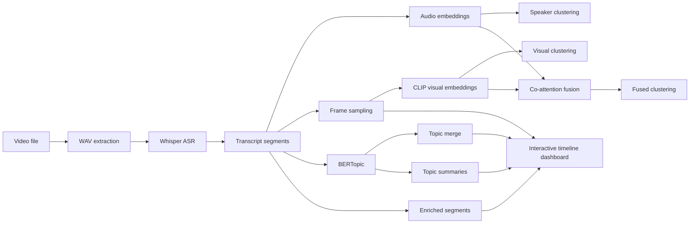

# Video Topic Modeling

This repository contains a research prototype pipeline for multimodal video topic modeling.

## Architecture



The pipeline is intentionally modular: transcription, audio/visual embeddings, clustering, topic extraction, topic summarization, and visualization are all separate stages so you can rerun only the slices you need.

## Pipeline stages

1. Extract WAV audio from video.
2. Transcribe speech segments with Whisper (`large-v3`) and timestamps.
3. Generate per-segment audio embeddings with `pyannote/embedding` (with MFCC fallback).
4. Run UMAP + HDBSCAN for speaker/event clustering.
5. Extract top-k representative frames per ASR segment.
6. Generate CLIP visual embeddings for each segment.
7. Apply UMAP + HDBSCAN to visual and fused embeddings.
8. Fuse audio+visual embeddings with an unsupervised co-attention-style strategy.
9. Run BERTopic over transcript segments, either unsupervised or guided with seed topics.
10. Reduce micro-topics and keep merged topic outputs.
11. Summarize topics locally (extractive).
12. Compute numeric evaluation metrics.
13. Render Plotly timeline by speaker and topic.

## Setup

```bash
python3 -m venv .venv
source .venv/bin/activate
pip install -r requirements.txt
```

Make sure `ffmpeg` is installed and available on `PATH`.

Optional environment variable for pyannote model access:

```bash
export HF_TOKEN=your_huggingface_token
```

## Run

```bash
python -m src.pipeline_run \
  --video data/7630817_h264_1920_1080_8000kb_baseline_de_8000.mp4 \
  --config configs/default.yaml
```

Run all MP4 files under a directory:

```bash
python -m src.pipeline_run \
  --all-mp4 \
  --video-dir data \
  --config configs/default.yaml
```

Run selected stages only:

```bash
python -m src.pipeline_run \
  --video data/7630817_h264_1920_1080_8000kb_baseline_de_8000.mp4 \
  --stages audio,asr,speaker,frames,clip,topic,viz
```

## Guided / Semi-supervised Topics

By default, BERTopic runs unsupervised. To guide topic discovery toward known themes, edit `configs/default.yaml` and add `topic.seed_topic_list` entries such as:

```yaml
topic:
  mode: guided
  seed_topic_list:
    - ["war", "conflict", "battle", "army"]
    - ["democracy", "freedom", "election", "parliament"]
    - ["peace", "reconciliation", "history", "memory"]
```

This keeps the model semi-supervised in the BERTopic sense: the embedding clustering still happens automatically, but the seed phrases steer the topic space toward your desired categories.

## Multimodal Topic Embedding Space

Topic modeling can run in two modes:

- `topic.embedding_source: text` (classic BERTopic text embeddings)
- `topic.embedding_source: multimodal` (tri-modal co-attention embeddings from text+audio+visual)
- `topic.embedding_source: both` (runs both, writes side-by-side outputs and metrics)

When `multimodal` is selected, the pipeline:

1. Encodes transcript segments as text embeddings.
2. Loads segment-level audio and visual embeddings.
3. Applies tri-modal co-attention fusion with configurable weights:
   - `topic.weight_text`
   - `topic.weight_audio`
   - `topic.weight_visual`
4. Uses the fused embedding space directly in BERTopic (`fit_transform(..., embeddings=...)`).

Example config:

```yaml
topic:
  embedding_source: multimodal
  weight_text: 0.34
  weight_audio: 0.33
  weight_visual: 0.33
```

## Visual Embedding Backend (CLIP or vLLM API)

The visual stage supports two backends:

- `clip`: local OpenCLIP image embeddings (default)
- `vllm_api`: embeddings fetched from a vLLM/OpenAI-compatible API endpoint

Example config for vLLM API mode:

```yaml
clip:
  backend: vllm_api
  vllm_base_url: http://localhost:8000/v1
  vllm_endpoint: /embeddings
  vllm_model: Qwen/Qwen2.5-VL-7B-Instruct
  vllm_api_key_env: VLLM_API_KEY
  vllm_timeout_s: 60
  fallback_embedding_dim: 1024
```

If your endpoint requires auth, set:

```bash
export VLLM_API_KEY=your_api_key
```

The pipeline sends each frame as a data-URI payload and expects an embedding response in a common JSON format (`data[0].embedding`, `embedding`, or `vector`).

## Numeric Metrics

A `metrics.json` file is generated in each output directory with quantitative indicators, including:

- segment and duration statistics
- topic count, noise ratio, normalized entropy, and topic-size Gini
- topic transition rate over time
- vocabulary and average token length
- topic diversity over top words
- NPMI-based topic coherence estimate
- clustering quality indices (silhouette, Calinski-Harabasz, Davies-Bouldin) on available audio/visual/fused/multimodal-topic embeddings using topic assignments

When `topic.embedding_source: both`, metrics are split by source:

- `metrics_text.json`
- `metrics_multimodal.json`
- `metrics_comparison.json`

When using `--all-mp4`, the pipeline also creates an aggregate report at:

- `data/output/metrics_all_videos.json`

## Outputs

Outputs are written under `data/processed/<video_stem>/` and `data/output/<video_stem>/`.

Important artifacts:
- `segments.json`
- `audio_embeddings.npy`, `visual_embeddings.npy`, `fused_embeddings.npy`
- `topic_info.json`, `topic_info_text.json`, `topic_info_multimodal.json`, `topic_info_merged.json`
- `topic_summaries.json`
- `metrics.json`, `metrics_text.json`, `metrics_multimodal.json`, `metrics_comparison.json`
- `multimodal_topic_embeddings.npy` (when `topic.embedding_source=multimodal`)
- `segments_enriched.json`, `segments_enriched_text.json`, `segments_enriched_multimodal.json`
- `timeline.html`
